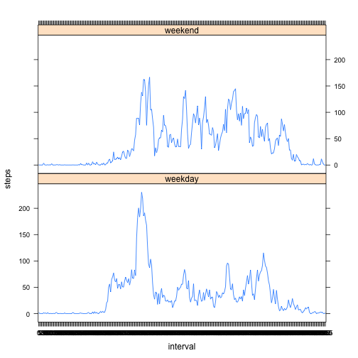

Activity Data Report
==============================

This R Markdown file takes a look at activity data from a pedometer in order to
practice using R Markdown. Measurements were taken in five minute intervals over
a two month period.

First we'll load the data from our working directory and summarize

```r
library(lattice)
data <- read.csv("activity.csv", header = TRUE)
summary(data)
```

```
##      steps               date          interval   
##  Min.   :  0.0   2012-10-01:  288   Min.   :   0  
##  1st Qu.:  0.0   2012-10-02:  288   1st Qu.: 589  
##  Median :  0.0   2012-10-03:  288   Median :1178  
##  Mean   : 37.4   2012-10-04:  288   Mean   :1178  
##  3rd Qu.: 12.0   2012-10-05:  288   3rd Qu.:1766  
##  Max.   :806.0   2012-10-06:  288   Max.   :2355  
##  NA's   :2304    (Other)   :15840
```

As you can see, there are NA values to consider. 

In order to better understand the data, here is the daily total number of steps,
the mean and median value, and a histogram of total steps per day


```r
dailydata <- aggregate(data$steps ~ data$date, FUN=sum)
colnames(dailydata) <- (c("date", "steps"))
hist(dailydata$steps)
```

 

```r
mean(dailydata$steps)
```

```
## [1] 10766
```

```r
median(dailydata$steps)
```

```
## [1] 10765
```

Taking a similar look at averages for each time interval. The following code
finds the mean number of steps for each time interval, then finds the max value.


```r
data$interval <- as.factor(data$interval)
intervaldata <- aggregate(data$steps ~ data$interval, FUN=mean)
colnames(intervaldata) <- c("interval", "steps")
plot(intervaldata$interval, intervaldata$steps, xlab = "interval", 
     ylab = "mean steps")
lines(intervaldata$interval, intervaldata$steps, type = "l")
```

 

```r
intervaldata[intervaldata$steps == max(intervaldata$steps), ]
```

```
##     interval steps
## 104      835 206.2
```

These aggregate data sets ignored the 2304 NA values that are present in the 
original dataset. The following code creates a new dataset and replaces NA 
values with the average number of steps for that interval. Summary provided for
verification of NA removal.


```r
data2 <- data
for (i in 1:length(data2$steps)) {
        if (is.na(data2$steps[i]) == TRUE){
                data2$steps[i] <- intervaldata[intervaldata$interval == 
                        data$interval[i], 2]
        }
}
summary(data2)
```

```
##      steps               date          interval    
##  Min.   :  0.0   2012-10-01:  288   0      :   61  
##  1st Qu.:  0.0   2012-10-02:  288   5      :   61  
##  Median :  0.0   2012-10-03:  288   10     :   61  
##  Mean   : 37.4   2012-10-04:  288   15     :   61  
##  3rd Qu.: 27.0   2012-10-05:  288   20     :   61  
##  Max.   :806.0   2012-10-06:  288   25     :   61  
##                  (Other)   :15840   (Other):17202
```

With the NA values removed, the following code aggregates the data to show
total number of steps per day. Mean and median values also produced.


```r
dailydata2 <- aggregate(data2$steps ~ data2$date, FUN=sum)
colnames(dailydata2) <- (c("date", "steps"))
hist(dailydata2$steps)
```

 

```r
mean(dailydata2$steps)
```

```
## [1] 10766
```

```r
median(dailydata2$steps)
```

```
## [1] 10766
```

Interestingly, replacing the NA values had very little impact on the mean and
median values or the shape of the histogram. It did change the frequency totals,
as days that had previously been ignored are now included.

Next, the analysis seeks to determine if there is a difference between weekday
and weekend activity levels. The following quote generates a new factor variable
"weekend" that captures whether the measurements were taken during a weekend
or weekday.


```r
data2$date <- as.Date(data2$date, format = "%Y-%m-%d")
data2$weekend <- as.character("empty")
for (i in 1:length(data2$date)){
        if (weekdays(data2$date[i]) == "Saturday" | weekdays(data2$date[i]) == "Sunday"){
                data2$weekend[i] <- "weekend"
        } else data2$weekend[i] <- "weekday"
}
data2$weekend <- (as.factor(data2$weekend))
summary(data2$weekend)
```

```
## weekday weekend 
##   12960    4608
```

Next, the following code aggregates the data and generates a lattice plot.


```r
intervaldata2 <- aggregate(steps ~ interval + weekend, data = data2, FUN=mean)
xyplot(steps ~ interval | weekend, data = intervaldata2, layout = c(1,2), type = "l")
```

 

